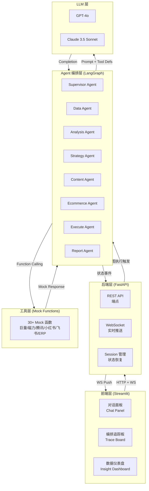
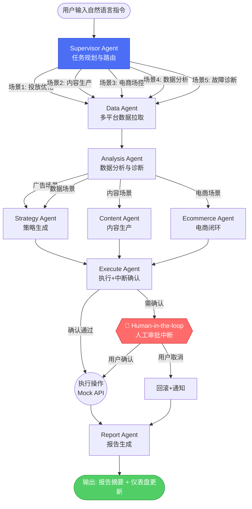
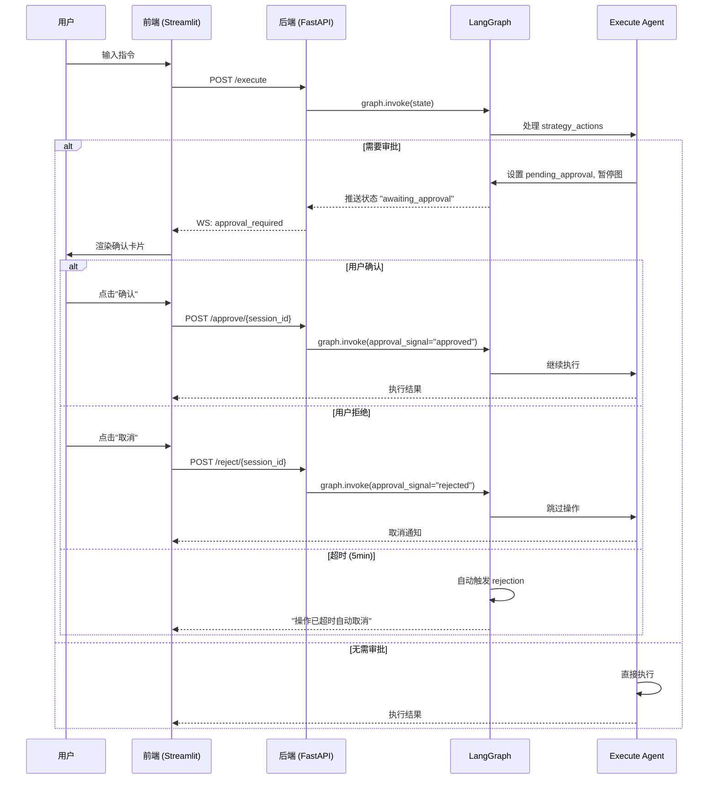
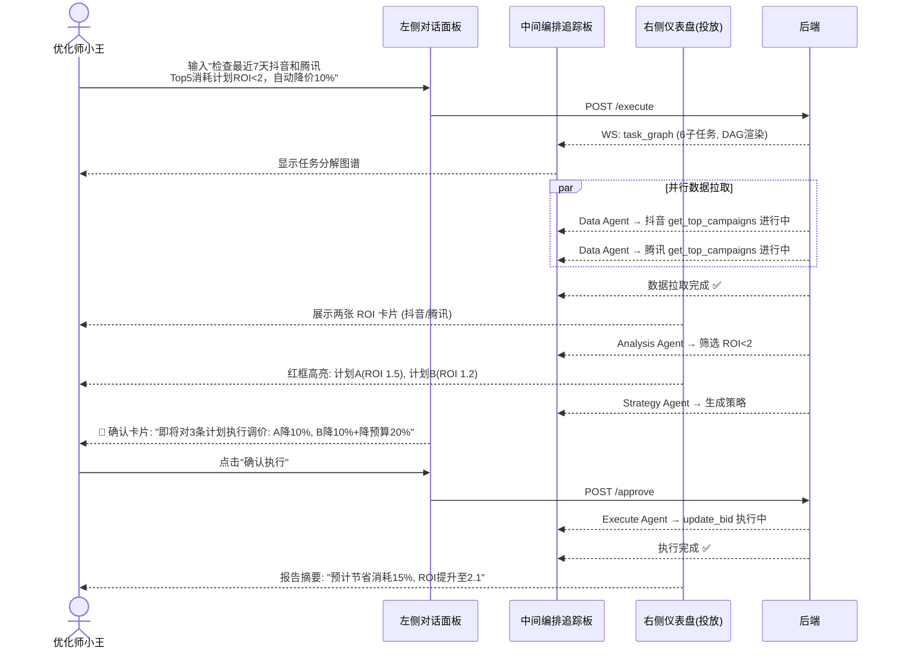
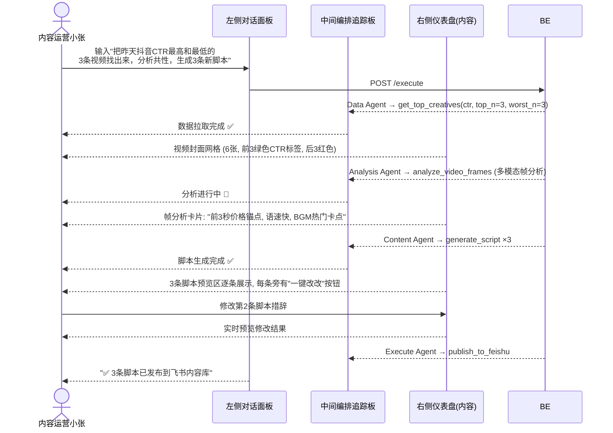
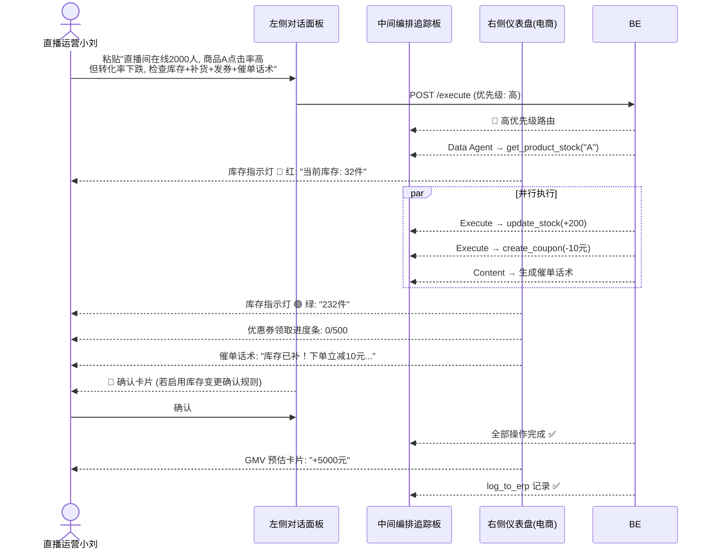
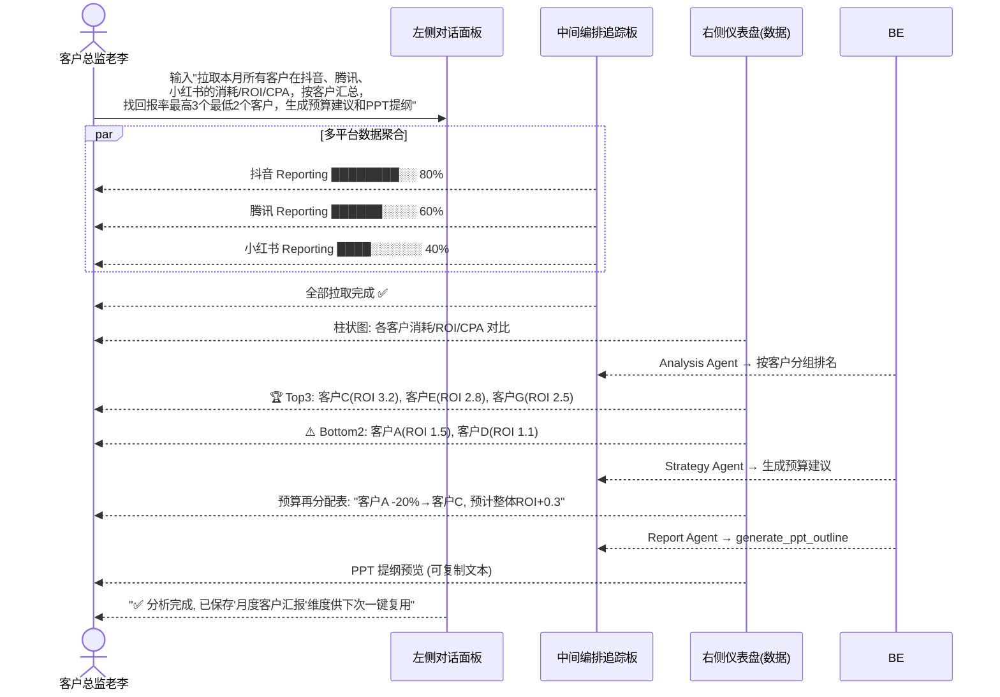
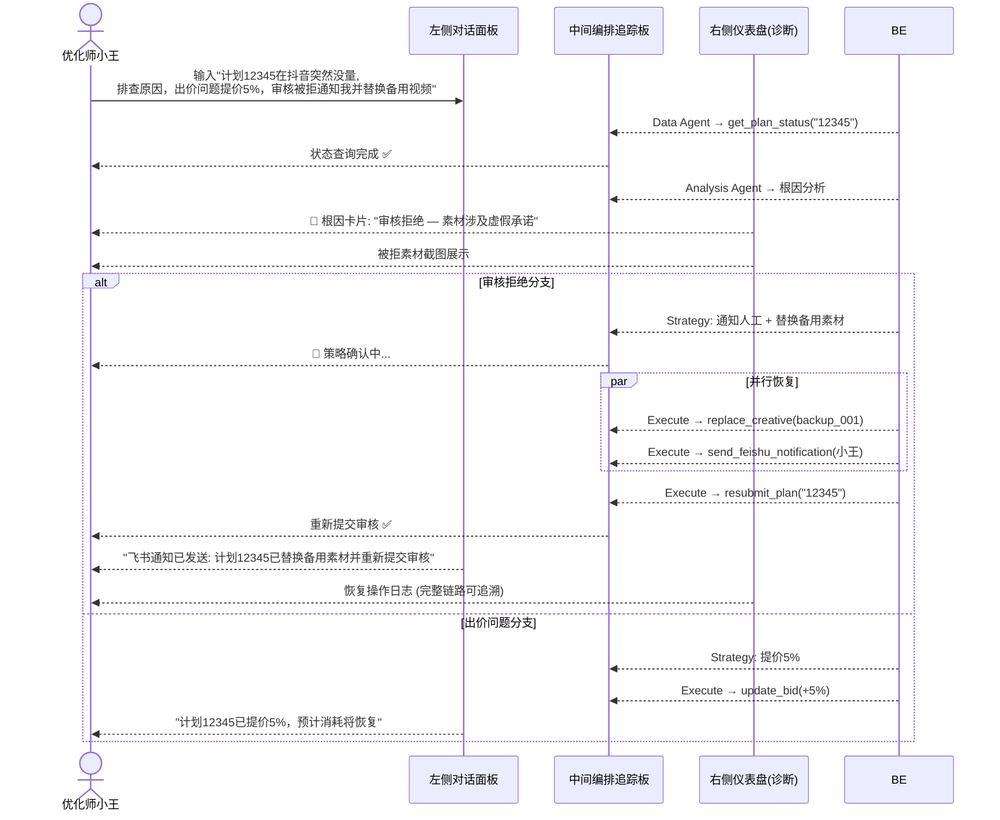

# Feature Specification: AdCockpit 数字营销 AI Agent 系统

**Feature Branch**: `001-adcockpit-system-spec`

**Created**: 2026-06-09

**Status**: Draft

**Input**: User description: "基于 myspec.md 和宪法，生成 AdCockpit 的完整功能规格，包含系统架构和 UI 设计"

## User Scenarios & Testing *(mandatory)*

### User Story 1 - 跨平台广告投放智能优化 (Priority: P1)

优化师小王早上到岗，在对话面板输入自然语言指令，要求系统检查最近 7 天在抖音
和腾讯广告上消耗排名 Top 5 的计划中 ROI 低于 2 的条目，自动对不达标计划降价 10%，
并生成优化报告。系统自动拆解任务，并行拉取多平台数据，分析异常，生成策略，
在执行前弹出确认卡片等待人工审批，审批通过后执行调价并输出报告摘要。

**Why this priority**: 广告投放优化是数字营销服务商的核心收入来源，跨平台 ROI
分析与自动调价是最直接体现 Multi-Agent 协作价值的场景。

**Independent Test**: 输入一条自然语言优化指令，验证系统能否完成数据拉取→分析→
策略→确认→执行→报告的完整链路，并在三栏界面中正确展示每一步。

**Acceptance Scenarios**:

1. **Given** 用户已登录且系统连接了抖音和腾讯广告的 Mock API，**When** 用户输入
"检查最近 7 天抖音和腾讯广告 Top 5 消耗计划中 ROI<2 的，自动降价 10% 并生成报告"，
**Then** 系统在中间面板展示任务分解为 6 个子任务，Data Agent 并行拉取两个平台数据，
Analysis Agent 筛选出 ROI<2 的计划并在右侧仪表盘高亮红框，Strategy Agent 生成
调价策略，左侧弹出确认卡片，用户确认后 Execute Agent 执行调价，右侧生成优化报告摘要。

2. **Given** 用户发出了优化指令但所有计划 ROI 均 >= 2，**When** Analysis Agent
未发现不达标计划，**Then** 系统在对话面板回复"当前所有计划 ROI 均达标，无需调价"，
右侧仪表盘展示绿色达标卡片。

3. **Given** 确认卡片已弹出，**When** 用户点击"取消"或拒绝确认，**Then** 系统
不执行任何调价操作，对话面板显示"操作已取消"，状态回滚。

---

### User Story 2 - 投后素材分析与 AI 内容工厂 (Priority: P2)

内容运营小张想基于投放数据优化素材，输入指令要求找出昨日抖音上点击率最高和
最低的视频，分析高点击视频的共性，基于爆款模板生成 3 条新的带货口播脚本，
并发布到飞书内容库。

**Why this priority**: 内容生产与广告投放的联动是全链路服务的关键差异化能力，
直接影响广告效果和客户续费率。

**Independent Test**: 输入素材分析指令，验证系统能否完成数据拉取→多模态分析→
脚本生成→内容发布的完整链路。

**Acceptance Scenarios**:

1. **Given** 系统已接入抖音 Mock API 和飞书 Mock API，**When** 用户输入
"把昨天抖音上 CTR 最高和最低的 3 条视频找出来，分析爆款共性，生成 3 条新脚本，
发布到飞书内容库"，**Then** Data Agent 拉取素材数据并在右侧展示视频封面和指标，
Analysis Agent 输出共性分析（如前 3 秒价格锚点、快语速、热门 BGM），Content Agent
生成 3 条脚本并在右侧预览区展示，Publish Agent 上传至飞书并在中间面板显示成功。

2. **Given** 素材数据拉取成功但分析 Agent 无法访问多模态 LLM，**When** 系统
检测到 LLM 调用失败，**Then** 系统在中间面板显示"帧分析服务暂不可用"的错误状态，
在对话面板提示用户可选择跳过分析直接基于 CTR 数据生成脚本。

---

### User Story 3 - 直播间实时 AI 场控与电商闭环 (Priority: P2)

直播运营小刘正在盯播，将实时大屏数据粘贴到对话框，要求系统检查商品库存、自动
补货、创建优惠券、生成催单话术。

**Why this priority**: 直播电商是增长最快的数字营销场景，实时响应能力和自动化
闭环直接影响 GMV，此场景最能体现系统的响应速度和电商闭环能力。

**Independent Test**: 粘贴一条直播间数据，验证系统能否完成库存查询→补货→
创建优惠券→生成话术的并行处理链路。

**Acceptance Scenarios**:

1. **Given** 用户粘贴了直播间实时数据（含商品 A 点击率高但转化率下跌），
**When** 系统识别为高优先级任务并执行，**Then** Data Agent 查询库存显示"32 件"并
标红，Execute Agent 并行执行补货（+200 件）和创建优惠券（-10 元），右侧仪表盘实时
展示券领取情况，Content Agent 生成催单话术推送至中控台，右侧显示预估 GMV 增量。

2. **Given** 系统设置了"库存变更需确认"规则，**When** 库存增加操作触发该规则，
**Then** 先弹出确认窗等待用户审批，审批通过后再执行，与自动优惠券创建并行进行。

3. **Given** 补货操作调用 ERP Mock API 时返回超时错误，**When** 系统检测到失败，
**Then** 在中间面板标记该操作为"失败"状态，自动触发重试（最多 3 次），对话面板
通知用户"补货操作第 N 次重试中"，达到最大重试后提示用户手动处理。

---

### User Story 4 - 跨渠道数据分析与预算决策助手 (Priority: P2)

客户总监老李需要为客户提案准备数据，要求拉取本月所有客户在多平台的整体消耗、
ROI 和 CPA，按客户分组汇总，找出预算回报率最高和最低的客户，生成下周预算再分配
建议和 PPT 提纲。

**Why this priority**: 数据分析是服务商展示专业度和获取客户信任的核心手段，
跨平台数据聚合和智能预算建议直接支撑客单价的提升。

**Independent Test**: 输入数据分析指令，验证系统能否完成多平台数据聚合→客户维度
汇总→排名分析→预算建议→PPT 提纲生成的完整链路。

**Acceptance Scenarios**:

1. **Given** 系统已连接所有平台的 Reporting Mock API，**When** 用户输入
"拉取本月所有客户在抖音、腾讯、小红书的消耗、ROI、CPA，按客户汇总，找回报率最高
3 个和最低 2 个客户，生成预算建议和 PPT 提纲"，**Then** Data Agent 逐平台拉取数据
并在中间面板显示进度条，Analysis Agent 在右侧展示客户 ROI 排名柱状图，Strategy
Agent 输出预算再分配建议，Report Agent 生成 PPT 提纲并在右侧显示可复制文本。

2. **Given** 某个平台的 Mock API 返回部分数据缺失（如小红书 CPA 字段为空），
**When** Analysis Agent 遇到缺失字段，**Then** 系统在中间面板标记"部分数据缺失"，
在右侧图表中标注"数据不完整"，在报告中注明平台数据覆盖范围，不阻断后续分析。

---

### User Story 5 - 全链路故障诊断与自主恢复 (Priority: P3)

优化师小王发现某条计划突然没量，输入指令要求排查原因，根据根因自动执行恢复
操作（出价问题→提价、审核拒绝→通知并替换备用素材）。

**Why this priority**: 故障自愈是高阶能力，展示系统在异常场景下的鲁棒性。虽然
优先级较低，但能显著提升用户体验和系统可靠性感知。

**Independent Test**: 输入故障诊断指令，验证系统能否完成状态查询→根因分析→
策略决策→自动恢复（或通知人工）的完整链路。

**Acceptance Scenarios**:

1. **Given** 计划 12345 在抖音 Mock API 中状态为"审核拒绝-素材虚假承诺"，
**When** 用户输入"帮我排查计划 12345 为什么没量，出价问题就提价 5%，审核被拒就
通知我并替换备选视频"，**Then** Data Agent 获取计划状态，Analysis Agent 识别根因
为审核拒绝并在中间卡片标红，Execute Agent 自动调用替换素材和重新提交审核，同时
发送飞书通知给用户，整个恢复链路自动完成。

2. **Given** 计划状态为"出价过低"，**When** Analysis Agent 判定根因为出价问题，
**Then** Strategy Agent 建议提价 5%，Execute Agent 执行 `update_bid(+5%)`，
对话面板显示"计划 12345 已提价 5%，预计消耗将恢复"。

3. **Given** 计划状态为未知异常（Mock API 返回无法识别的状态码），**When**
Analysis Agent 无法确定根因，**Then** 系统将该任务升级为需人工介入，在对话面板
展示所有原始数据，在中间面板标记"诊断失败-需人工排查"。

---

### Edge Cases

- 当用户在审批卡片弹出但未操作时，系统如何处理超时？（默认 5 分钟超时后自动取消，
  对话面板通知用户"操作已超时自动取消"）
- 当多个场景指令同时输入或快速连续输入时，系统如何排队和优先级管理？
- 当 Mock API 返回的数据量过大（如 1000 条计划）时，前端渲染和 Agent 处理是否会超时？
- 当用户在 Agent 执行中途关闭浏览器或刷新页面时，任务状态如何恢复？
- 当两个用户同时使用系统时，Mock 数据是否隔离？

## Requirements *(mandatory)*

### Functional Requirements — 系统架构

**分层架构**

- **FR-ARCH-001**: 系统 MUST 采用五层架构：前端展示层 (Streamlit)、后端 API 层
  (FastAPI + WebSocket)、Agent 编排层 (LangGraph StateGraph)、工具层 (30+ Mock 函数)、
  LLM 层 (GPT-4o / Claude 3.5 Sonnet)。
- **FR-ARCH-002**: 前端与后端 MUST 通过 WebSocket 维持实时双向通信，Agent 执行
  过程中的每个步骤状态变更 MUST 实时推送到前端。
- **FR-ARCH-003**: Agent 编排层 MUST 独立于前后端，可通过 FastAPI 端点触发图执行，
  支持查询执行历史和状态恢复。

**架构图**:


---

### Functional Requirements — Multi-Agent 编排

**Agent 角色定义**

- **FR-AGENT-001**: 系统 MUST 包含 8 个专业 Agent：Supervisor、Data、Analysis、
  Strategy、Content、Ecommerce、Execute、Report。
- **FR-AGENT-002**: Supervisor Agent MUST 负责任务分解、子任务路由、并行/串行执行
  编排、中断信号捕获与分发。
- **FR-AGENT-003**: Data Agent MUST 负责调用所有平台 Mock API，支持并行拉取，
  返回统一 Schema 的数据结构。
- **FR-AGENT-004**: Analysis Agent MUST 负责数据筛选、异常检测、多模态素材分析、
  分组汇总、归因判断。
- **FR-AGENT-005**: Strategy Agent MUST 基于分析结果生成可执行的动作策略
  （调价/调预算/替换素材/分配预算等），每条策略 MUST 包含：目标对象、操作类型、
  参数值、预期效果、风险等级。
- **FR-AGENT-006**: Content Agent MUST 负责生成口播脚本/文案，基于爆款模板进行
  创意扩展，输出可直接使用的文本内容。
- **FR-AGENT-007**: Ecommerce Agent MUST 负责库存查询与调整、优惠券创建与管理、
  直播间实时指标监控与预警。
- **FR-AGENT-008**: Execute Agent MUST 作为统一操作执行入口，支持人工确认中断、
  操作前校验、执行结果回传、失败自动重试（最多 3 次）。
- **FR-AGENT-009**: Report Agent MUST 负责聚合所有步骤的输出，生成结构化报告
  （优化摘要/PPT 提纲/数据报表），支持一键复制和导出。

**Agent 协作图**:


**数据流说明**:

| 节点 | 输入 | 输出 | 下游 |
|------|------|------|------|
| Supervisor | 用户原始文本 | `task_graph`: 子任务列表 + 执行顺序 | Data Agent |
| Data Agent | `task_graph.platforms[]` | `platform_data[]`: 统一 Schema 的平台数据 | Analysis Agent |
| Analysis Agent | `platform_data[]` | `analysis_result`: 异常列表/排名/共性/根因 | Strategy / Content / Ecommerce |
| Strategy Agent | `analysis_result` | `actions[]`: 策略动作列表（含风险等级） | Execute Agent |
| Content Agent | `analysis_result.creative_insights` | `scripts[]`: 生成的脚本/文案列表 | Execute Agent |
| Ecommerce Agent | `analysis_result.stock_gap` | `actions[]`: 补货/优惠券操作 | Execute Agent |
| Execute Agent | `actions[]` | `execution_results[]`: 执行结果+状态 | Report Agent |
| Report Agent | 所有上游输出 | `report`: 结构化报告 | 前端仪表盘 |

---

### Functional Requirements — LangGraph State 定义

**State 结构**

- **FR-STATE-001**: 系统 MUST 使用 TypedDict 定义 AgentState，包含以下字段：
  `user_input`, `task_graph`, `platform_data`, `analysis_result`, `strategy_actions`,
  `execution_results`, `report`, `pending_approval`, `conversation_history`,
  `error_log`, `session_id`。
- **FR-STATE-002**: `pending_approval` 字段 MUST 支持 Human-in-the-loop 中断，
  当该字段非空时 LangGraph 图执行 MUST 暂停等待外部信号。
- **FR-STATE-003**: `conversation_history` MUST 作为短期记忆，保留最近 20 轮对话；
  `session_id` MUST 关联长期记忆存储（用户偏好、模板、分析维度）。

**State 定义**:
```python
from typing import TypedDict, List, Optional, Dict, Any, Literal
from langgraph.graph import StateGraph

class TaskNode(TypedDict):
    id: str
    type: Literal["fetch_data", "analyze", "strategize", "execute", "report"]
    platform: Optional[str]
    params: Dict[str, Any]
    depends_on: List[str]
    status: Literal["pending", "running", "done", "failed", "awaiting_approval"]

class PlatformData(TypedDict):
    platform: str
    endpoint: str
    data: List[Dict[str, Any]]
    fetched_at: str
    error: Optional[str]

class StrategyAction(TypedDict):
    target_id: str
    target_type: str          # "campaign", "creative", "product", "budget"
    action: str               # "update_bid", "replace_creative", "add_stock", "create_coupon"
    params: Dict[str, Any]
    risk_level: Literal["low", "medium", "high"]
    expected_effect: str
    requires_approval: bool

class ExecutionResult(TypedDict):
    action: StrategyAction
    status: Literal["success", "failed", "cancelled", "retrying"]
    response: Optional[Dict[str, Any]]
    error: Optional[str]
    retry_count: int
    executed_at: str

class AgentState(TypedDict):
    user_input: str
    task_graph: List[TaskNode]
    platform_data: List[PlatformData]
    analysis_result: Dict[str, Any]
    strategy_actions: List[StrategyAction]
    execution_results: List[ExecutionResult]
    report: Dict[str, Any]
    pending_approval: Optional[List[StrategyAction]]
    conversation_history: List[Dict[str, str]]
    error_log: List[Dict[str, Any]]
    session_id: str
    current_scene: Literal["ad_placement", "content", "ecommerce", "data_analysis", "diagnosis"]
```

**五大场景 State 流转**:

| 阶段 | 场景1 投放优化 | 场景2 内容生产 | 场景3 电商场控 | 场景4 数据分析 | 场景5 故障诊断 |
|------|-------------|-------------|-------------|-------------|-------------|
| Init | `user_input` 设值, `current_scene`="ad_placement" | `current_scene`="content" | `current_scene`="ecommerce" | `current_scene`="data_analysis" | `current_scene`="diagnosis" |
| Fetch | `platform_data` ← 抖音+腾讯 | `platform_data` ← 抖音素材数据 | `platform_data` ← 库存+券状态 | `platform_data` ← 3 平台聚合 | `platform_data` ← 单计划状态 |
| Analyze | `analysis_result.roi_below_2` 填充 | `analysis_result.creative_insights` 填充 | `analysis_result.stock_gap` 填充 | `analysis_result.customer_ranking` 填充 | `analysis_result.root_cause` 填充 |
| Decide | `strategy_actions` ← 降价/降预算 | `strategy_actions` ← 发布脚本 | `strategy_actions` ← 补货+发券 | `strategy_actions` ← 预算再分配 | `strategy_actions` ← 提价/替换素材 |
| HITL | `pending_approval` 设值→等待确认 | 无中断（自动发布） | 可选中断（依规则） | 无中断 | 无中断（自动恢复） |
| Execute | `execution_results` ← 调价结果 | `execution_results` ← 发布结果 | `execution_results` ← 补货+券结果 | — | `execution_results` ← 恢复结果 |
| Report | `report` ← 优化摘要 | `report` ← 内容发布摘要 | `report` ← GMV 预估 | `report` ← PPT 提纲 | `report` ← 诊断报告 |

---

### Functional Requirements — 工具层 Mock 函数

- **FR-TOOL-001**: 系统 MUST 提供至少 30 个 Mock 函数，覆盖广告投放、内容生产、
  电商闭环、数据分析、通知推送五大类。
- **FR-TOOL-002**: 每个 Mock 函数 MUST 模拟真实的 Request/Response JSON Schema。
- **FR-TOOL-003**: 每个 Mock 函数 MUST 在 10% 概率下返回业务异常（如审核拒绝、
  余额不足），在 5% 概率下返回网络异常（500、超时），以测试系统鲁棒性。
- **FR-TOOL-004**: Mock 数据 MUST 具有内部一致性——同一 `plan_id` 在不同查询中
  返回一致的属性值（如名称、预算、状态）。

**Mock 函数清单**:

##### 一、广告投放域 (Ad Placement Domain)

| # | 函数签名 | 描述 | 返回示例 (成功) | 异常模拟 |
|---|---------|------|----------------|---------|
| 1 | `get_top_campaigns(platform: str, days: int, metric: str, top_n: int) -> List[Campaign]` | 获取平台 Top N 计划 | `[{id:"C001", cost:15000, roi:1.5, status:"active"}]` | `AdPlatformTimeout`, `InvalidMetricError` |
| 2 | `get_campaign_detail(platform: str, campaign_id: str) -> CampaignDetail` | 获取计划详情 | `{id:"C001", bid:25.0, budget:5000, targeting:{...}}` | `CampaignNotFound` |
| 3 | `update_bid(platform: str, campaign_id: str, new_bid: float) -> bool` | 更新出价 | `{success:true, new_bid:22.5}` | `BidOutOfRange`, `AccountInsufficientBalance` |
| 4 | `update_budget(platform: str, campaign_id: str, new_budget: float) -> bool` | 更新预算 | `{success:true, new_budget:4500}` | `BudgetBelowMinimum` |
| 5 | `get_plan_status(platform: str, plan_id: str) -> PlanStatus` | 获取计划状态（含审核） | `{status:"active", review_status:"approved", bid:30}` | `PlanNotFound` |
| 6 | `replace_creative(platform: str, plan_id: str, new_video_id: str) -> bool` | 替换素材并重新提交审核 | `{success:true, review_id:"RV-002"}` | `CreativeNotFound`, `ReviewRejected` |
| 7 | `resubmit_plan(platform: str, plan_id: str) -> bool` | 重新提交审核 | `{success:true, new_status:"pending_review"}` | `ResubmitLimitExceeded` |
| 8 | `get_platform_report(platform: str, start_date: str, end_date: str, dimensions: List[str], metrics: List[str]) -> ReportData` | 获取平台报表（消耗/ROI/CPA） | `{rows:[{date:"06-01",cost:5000,roi:2.1,cpa:35}]}` | `ReportTimeout`, `PartialDataAvailable` |

##### 二、内容生产域 (Content Production Domain)

| # | 函数签名 | 描述 | 返回示例 (成功) | 异常模拟 |
|---|---------|------|----------------|---------|
| 9 | `get_top_creatives(platform: str, metric: str, date: str, top_n: int, worst_n: int) -> List[Creative]` | 获取高/低点击素材 | `[{id:"V001",ctr:0.05,completion_rate:0.8,url:"..."}]` | `CreativeDataNotReady` |
| 10 | `analyze_video_frames(video_url: str) -> FrameAnalysis` | 多模态帧分析 | `{key_frames:[{ts:3,objects:["price_tag"],text:"仅需99"}]}` | `VideoUnavailable`, `FrameAnalysisTimeout` |
| 11 | `generate_script(template_id: str, params: Dict) -> str` | 基于模板生成口播脚本 | `"库存已补！现在下单立减10元，只剩最后200件，手慢无！"` | `TemplateNotFound` |
| 12 | `publish_to_feishu(repo: str, files: List[Dict]) -> bool` | 发布内容到飞书知识库 | `{success:true, urls:["https://feishu.cn/doc/..."]}` | `FeishuAuthExpired`, `UploadFailed` |

##### 三、电商闭环域 (E-commerce Closed Loop Domain)

| # | 函数签名 | 描述 | 返回示例 (成功) | 异常模拟 |
|---|---------|------|----------------|---------|
| 13 | `get_product_stock(product_id: str) -> StockInfo` | 查询商品库存 | `{product_id:"A", stock:32, reserved:10, status:"low_stock"}` | `ProductNotFound` |
| 14 | `update_stock(product_id: str, add_amount: int) -> bool` | 增加库存 | `{success:true, new_stock:232}` | `ERPTimeout`, `StockUpdateRejected` |
| 15 | `create_coupon(product_id: str, discount: float, channel: str, total: int) -> Coupon` | 创建优惠券 | `{coupon_id:"CP001",code:"LIVE10",claimed:0,total:500}` | `CouponLimitExceeded`, `DiscountOutOfRange` |
| 16 | `get_live_metrics(room_id: str) -> LiveMetrics` | 获取直播间实时指标 | `{online:2000,gmv:85000,conversion_rate:0.03}` | `LiveRoomOffline` |
| 17 | `send_live_script(room_id: str, script: str, target: str) -> bool` | 推送话术到中控台/弹窗 | `{success:true, delivered_to:"main_screen"}` | `LiveRoomOffline` |

##### 四、数据分析域 (Data Analysis Domain)

| # | 函数签名 | 描述 | 返回示例 (成功) | 异常模拟 |
|---|---------|------|----------------|---------|
| 18 | `get_multi_platform_report(platforms: List[str], start_date: str, end_date: str, group_by: str) -> AggregatedReport` | 多平台聚合报表 | `{groups:[{name:"客户A",cost:50000,roi:1.5,cpa:40}]}` | `PartialPlatformFailure` |
| 19 | `generate_budget_proposal(current_allocation: Dict, constraints: Dict) -> BudgetProposal` | 生成预算分配建议 | `{proposal:[{client:"A",change:"-20%",reason:"ROI<2"}]}` | `InsufficientData` |
| 20 | `generate_ppt_outline(title: str, data: Dict, template: str) -> PPTOutline` | 生成 PPT 提纲 | `{slides:[{title:"概述",bullets:[...],chart_type:"bar"}]}` | `TemplateNotFound` |

##### 五、通知与系统域 (Notification & System Domain)

| # | 函数签名 | 描述 | 返回示例 (成功) | 异常模拟 |
|---|---------|------|----------------|---------|
| 21 | `send_feishu_notification(user_id: str, title: str, content: str, priority: str) -> bool` | 发送飞书通知 | `{success:true, msg_id:"msg_001"}` | `FeishuRateLimit` |
| 22 | `log_to_erp(event_type: str, payload: Dict) -> bool` | 记录到 ERP 日志 | `{success:true, log_id:"ERP-001"}` | `ERPUnavailable` |
| 23 | `save_user_preference(session_id: str, key: str, value: Any) -> bool` | 保存用户偏好（长期记忆） | `{success:true}` | — |
| 24 | `load_user_preference(session_id: str, key: str) -> Optional[Any]` | 加载用户偏好 | `{key:"default_roi_threshold",value:2.0}` | — |

---

### Functional Requirements — Human-in-the-loop 中断机制

- **FR-HITL-001**: Execute Agent 在执行操作前 MUST 检查 `requires_approval` 标志，
  若为 True 则 MUST 将动作放入 `pending_approval` 并暂停图执行。
- **FR-HITL-002**: 前端 MUST 在接收到 `pending_approval` 非空信号时，在左侧对话
  面板渲染确认卡片，展示：操作摘要、影响对象、预期效果、风险等级。
- **FR-HITL-003**: 用户确认后，前端通过 REST API 发送 `approval_signal`，LangGraph
  图 MUST 从断点恢复执行；用户拒绝后，发送 `rejection_signal`，系统 MUST 跳过该
  操作并记录取消日志。
- **FR-HITL-004**: 确认卡片 MUST 支持超时处理——默认 5 分钟无响应自动视为拒绝。
- **FR-HITL-005**: 系统 MUST 支持可配置的审批规则：
  - `always_approve`: 低风险操作自动执行（如生成报告）
  - `always_confirm`: 高风险操作必须确认（如调价 >20%、替换主素材、库存变更）
  - `threshold_based`: 按金额/比例阈值决定（如调价 >10% 需确认）

**中断时序图**:


---

### Functional Requirements — UI 设计

**三栏布局组件树**

- **FR-UI-001**: 前端 MUST 采用固定三栏布局：左侧 25% (对话面板) + 中间 40%
  (编排追踪板) + 右侧 35% (数据仪表盘)，支持左右拖动调整比例。
- **FR-UI-002**: 左侧对话面板 MUST 包含：消息列表、输入框、历史记录抽屉、
  确认卡片内嵌渲染区、场景快捷指令按钮组。
- **FR-UI-003**: 中间编排追踪板 MUST 包含：任务分解图谱（DAG 可视化）、
  Agent 执行步骤时间线、工具调用详情展开面板（Req/Res JSON）、状态标识图标
  （等待⏳/进行中🔄/成功✅/失败❌/需确认🛑）、错误重试按钮。
- **FR-UI-004**: 右侧数据仪表盘 MUST 根据 `current_scene` 自动切换视图模板。

**组件树**:
```
App (Streamlit Page)
├── st.columns([0.25, 0.40, 0.35])
│
├── LeftPanel (对话面板)
│   ├── ChatHistory          # 消息列表 (用户消息 + AI 回复 + 系统通知)
│   ├── ChatInput            # 底部固定输入框 + 发送按钮
│   ├── SceneShortcuts       # 场景快捷指令按钮组 (投放/内容/电商/数据/诊断)
│   ├── ApprovalCard         # 确认/干预弹窗 (条件渲染)
│   └── HistoryDrawer        # 侧拉历史记录
│
├── CenterPanel (编排追踪板)
│   ├── TaskGraphView        # DAG 任务分解图谱 (Mermaid/Graphviz 渲染)
│   ├── AgentTimeline        # Agent 执行步骤时间线组件
│   │   └── TimelineItem     # 单步骤: 图标+标题+耗时+状态
│   ├── ToolCallDetail       # 工具调用详情 (可展开: Req JSON + Res JSON)
│   └── ErrorPanel           # 错误信息 + 重试按钮
│
└── RightPanel (数据仪表盘)
    ├── SceneRouter          # 根据 current_scene 切换子视图
    ├── AdDashboard           # 投放视图: ROI 卡片/趋势图/异常高亮
    ├── ContentDashboard      # 内容视图: 视频预览/脚本编辑器/发布状态
    ├── EcommerceDashboard    # 电商视图: 库存看板/优惠券领取/直播间指标
    └── DataDashboard         # 数据视图: 柱状图/PPT 提纲/预算建议表
```

**核心组件接口**:

| 组件 | 输入 Props | 输出 Events | 说明 |
|------|-----------|-------------|------|
| `ChatInput` | `placeholder: str` | `on_send(text: str)` | 底部固定输入框 |
| `ApprovalCard` | `actions: List[StrategyAction]` | `on_approve()`, `on_reject()` | 条件渲染确认卡片 |
| `TaskGraphView` | `task_graph: List[TaskNode]` | — | DAG 图谱只读渲染 |
| `AgentTimeline` | `execution_results: List[ExecutionResult]` | `on_retry(action_id: str)` | 时间线组件 |
| `ToolCallDetail` | `tool_name: str, request: Dict, response: Dict` | — | 可展开 JSON |
| `SceneRouter` | `current_scene: str, data: Dict` | — | 场景路由分发 |
| `AdDashboard` | `platform_data, analysis_result` | — | ROI 卡片+趋势 |
| `ContentDashboard` | `scripts: List[str], publish_status` | `on_edit(script_id)` | 脚本预览+编辑 |
| `EcommerceDashboard` | `stock_info, coupon_status, live_metrics` | — | 库存+券+直播 |
| `DataDashboard` | `report_data, ppt_outline` | — | 图表+提纲 |

---

### Functional Requirements — 右侧仪表盘视图切换逻辑

- **FR-UI-005**: 右侧仪表盘 MUST 根据 Supervisor Agent 识别的 `current_scene` 自动
  切换视图，切换逻辑如下：

| `current_scene` 值 | 渲染视图 | 核心展示元素 | 触发条件 |
|-------------------|---------|-------------|---------|
| `ad_placement` | AdDashboard | ROI 指标卡片（绿/黄/红）、消耗趋势折线图、不达标计划高亮列表、调价前后对比 | 用户指令涉及广告投放/优化关键词 |
| `content` | ContentDashboard | 视频封面网格（含 CTR 标签）、帧分析结果卡片、AI 生成脚本预览文本区、"一键改改"编辑按钮、发布状态标签 | 用户指令涉及素材/内容/脚本关键词 |
| `ecommerce` | EcommerceDashboard | 实时在线人数仪表盘、库存状态指示灯（绿/黄/红）、优惠券领取进度条、催单话术展示、预估 GMV 增量卡片 | 用户指令涉及直播/库存/优惠券关键词 |
| `data_analysis` | DataDashboard | 按客户分组柱状图（消耗/ROI/CPA）、回报率排名 Top/Bottom 列表、预算再分配建议表、PPT 提纲可复制文本区 | 用户指令涉及报表/分析/预算关键词 |
| `diagnosis` | AdDashboard (诊断模式) | 计划状态详情卡片、根因分析结果（含标红/标绿）、自动恢复操作日志、飞书通知发送状态 | 用户指令涉及排查/诊断/故障关键词 |

---

### Functional Requirements — 五大场景 UI 交互序列

**场景 1: 跨平台广告投放优化**



**场景 2: 投后素材分析与 AI 内容工厂**



**场景 3: 直播间实时 AI 场控与电商闭环**



**场景 4: 跨渠道数据分析与预算决策**



**场景 5: 全链路故障诊断与自主恢复**



### Key Entities

- **Campaign (广告计划)**: 广告投放的基本单位，包含平台归属、出价、预算、ROI、
  状态、关联素材 ID。属于 `platform_data` 的核心实体。
- **Creative (创意素材)**: 视频/图片素材，包含 CTR、完播率、帧分析结果、模板标签。
  属于内容生产域的核心实体。
- **Product (商品)**: 电商商品，包含 SKU、库存量、关联优惠券、直播间实时指标。
  属于电商闭环域的核心实体。
- **AgentState (全局状态)**: LangGraph 的运行时状态对象，贯穿所有场景，包含
  任务图、平台数据、分析结果、策略动作、执行结果、审批状态、会话记忆。
- **StrategyAction (策略动作)**: 由 Strategy/Content/Ecommerce Agent 生成，
  由 Execute Agent 执行，包含目标对象、操作类型、参数、风险等级、是否需要审批。
- **Report (报告)**: 由 Report Agent 生成的最终输出，包含结构化摘要、数据图表、
  PPT 提纲、优化建议，供用户查看和复制。
- **Session (会话)**: 用户会话记录，包含对话历史（短期记忆）、偏好存储（长期记忆）、
  执行历史（支持中断恢复）。

## Success Criteria *(mandatory)*

### Measurable Outcomes

- **SC-001**: 用户输入自然语言指令后，系统在 10 秒内完成任务分解并在中间面板展示
  DAG 图谱（含子任务数量和依赖关系）。
- **SC-002**: 所有五个核心场景（投放优化、内容生产、电商场控、数据分析、故障诊断）
  均可从自然语言输入到报告输出的完整走通，每个场景的端到端完成时间不超过 60 秒。
- **SC-003**: 右侧仪表盘在 `current_scene` 切换后，视图在 1 秒内完成渲染切换。
- **SC-004**: Human-in-the-loop 确认卡片在触发确认条件后 2 秒内渲染到左侧面板，
  用户确认/拒绝操作后 Agent 图在 1 秒内恢复执行。
- **SC-005**: Mock 函数在 10% 业务异常概率和 5% 网络异常概率下，系统仍能完成至少
  80% 的任务步骤（通过降级、重试、人工兜底）。
- **SC-006**: 中间编排追踪板展示的 Agent 执行步骤与实际后端执行状态一致，延迟
  不超过 2 秒（通过 WebSocket 实时同步）。
- **SC-007**: 基于 myspec.md 中定义的五类用户场景（小王/小张/小刘/老李 ×
  投放/内容/电商/数据/诊断），每个角色的任务完成率达到 100%（首次使用无卡点）。

## Assumptions

- Demo 环境为单用户本地运行（`streamlit run` 一键启动），无需考虑多租户数据隔离
  和并发访问冲突。
- 所有外部平台 API 均使用 Mock 函数，不依赖真实 API Token 或网络环境。
- LLM 调用deepseek在 Demo 环境中可用且延迟可接受
  （单次调用 < 5 秒）。
- 前端展示分辨率为 1920×1080，三栏比例默认为 25%/40%/35%，支持拖动调整。
- 确认卡片超时时间默认为 5 分钟，可在配置中修改。
- 长期记忆（用户偏好、模板、分析维度）存储在本地 JSON 文件中，重启后保留。
- 飞书通知和 ERP 日志均为 Mock 实现，不实际发送消息或写入外部系统。

---

## Implementation Status (v1.0, 2026-06-11)

**Architecture**: Streamlit direct-call (no separate backend required).
FastAPI layer (`api/`) retained as optional.

**Implemented**:

| Area | Status |
|------|--------|
| Three-column cockpit UI (32%/26%/42%) | ✅ |
| 6 mutually-exclusive tabs (optimize/create/content/ecommerce/data_analysis/diagnosis) | ✅ |
| Intent classification (conversational vs business) | ✅ |
| Streaming animation engine (flow tracker + typing cards) | ✅ |
| Optimization flow: param card → animation → approval → execute → Feishu report | ✅ |
| Content production: param card → preview → animation → confirm → Feishu publish | ✅ |
| Campaign creation: form → animation → confirm → go live | ✅ |
| Real Feishu document API integration (with mock fallback) | ✅ |
| 24 Mock functions (10% business + 5% network exceptions) | ✅ |
| Dynamic dashboard: scene-adaptive views + paginated sortable tables | ✅ |
| LangGraph agent graph (8 agents, optional) | ✅ |
| Human-in-the-loop (parameter customization + confirm-before-execute) | ✅ |
| `_find_plan` returns original reference for in-place mutations | ✅ |

**Architecture**: `Streamlit → direct call → Mock Functions / Feishu Client`
